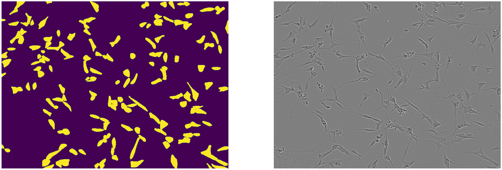
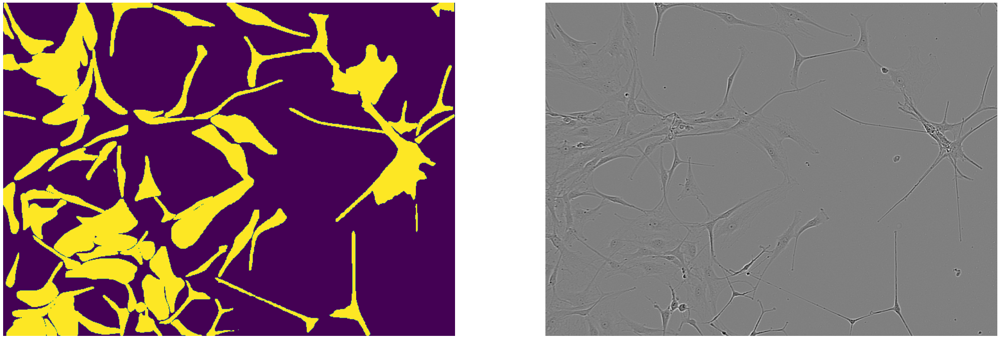
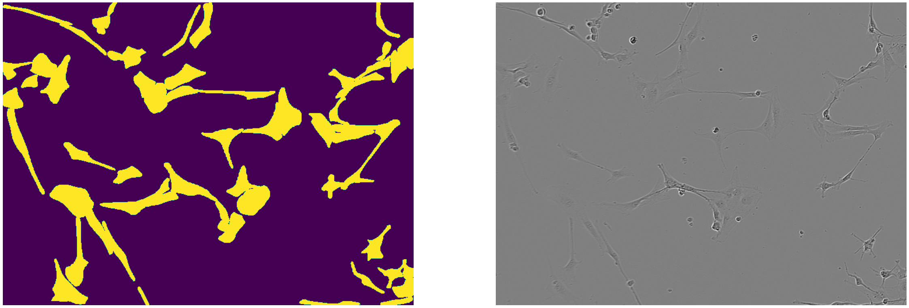

# Neuronal Cell Instance Segmentation

# Neuronal Cell Instance Segmentation

Segmenting individual neuronal cells from phase-contrast microscopy images, using Detectron2 and a Cascade Mask R-CNN with a ResNet-152 backbone.

Data comes from the [Sartorius Cell Instance Segmentation](https://www.kaggle.com/competitions/sartorius-cell-instance-segmentation) dataset.










## The problem

Counting and measuring cells by hand is slow and inconsistent, and phase-contrast images make it harder than it sounds: neurons overlap, they have thin processes that blur into the background, and the contrast between cell and medium is low. Semantic segmentation isn't enough here — you need *instance* segmentation, because two touching cells have to come out as two objects, not one blob.

## Approach

- **Cascade Mask R-CNN (ResNet-152)** in Detectron2, which refines box proposals over several stages instead of one. That extra refinement matters when cells sit on top of each other.
- **A custom NMS + weighted ensemble step** that merges predictions from several models. Standard NMS throws away overlapping boxes, which is exactly the wrong behaviour when the overlap is real. The custom version weights and merges instead of discarding.
- **Morphological post-processing** to close holes inside masks and clean up ragged boundaries.

## Evaluation

Scored with mean Average Precision across IoU thresholds from 0.50 to 0.95, which is the standard metric for this dataset. It's a demanding measure for cell segmentation: at the high thresholds, a mask that's visibly correct to a human can still score zero if the boundary is a few pixels off. That's part of why numbers on this task look low compared to typical classification benchmarks.

Exact figures aren't reproduced here — the trained checkpoint isn't in the repo, and I'd rather leave the section empty than quote a number I can't regenerate.

What I can say about behaviour, from inspecting predictions:

- **Isolated cells are close to solved.** Clean, well-separated cells segment reliably, and the remaining error is boundary precision rather than detection.
- **Dense clusters are where it breaks.** Overlapping cells get merged into single instances, or one cell gets split across two. This is the regime that actually matters, since sparse fields are easy to count by hand.
- **Thin processes get truncated.** Neurites drop below the contrast threshold and the mask stops at the soma, which would matter for any downstream morphology measurement.
- **The ensemble step helped most on the cluster cases**, which is what motivated the custom merge logic in the first place — standard NMS discards overlapping boxes, and here the overlap is real signal rather than duplicate detections.

To reproduce: retrain from `cell_segmentation.ipynb` and run the evaluation cell against the validation split.

## What I'd do differently

- The morphological post-processing is hand-tuned, and the parameters almost certainly don't transfer to a different microscope or cell line. A learned refinement step would be more honest.
- I didn't do proper cross-validation, so treat the numbers as indicative rather than precise.
- Performance drops on the densest clusters, which is where segmentation is most useful. That's the part I'd attack next.

## Running it

```bash
pip install -r requirements.txt
jupyter notebook cell_segmentation.ipynb
```

Detectron2 needs to be installed separately and is version-sensitive about CUDA — see the [official install guide](https://detectron2.readthedocs.io/en/latest/tutorials/install.html).

---

Built by Vladimir Tsoy, Applied Mathematics @ UCLA.


